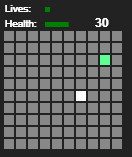
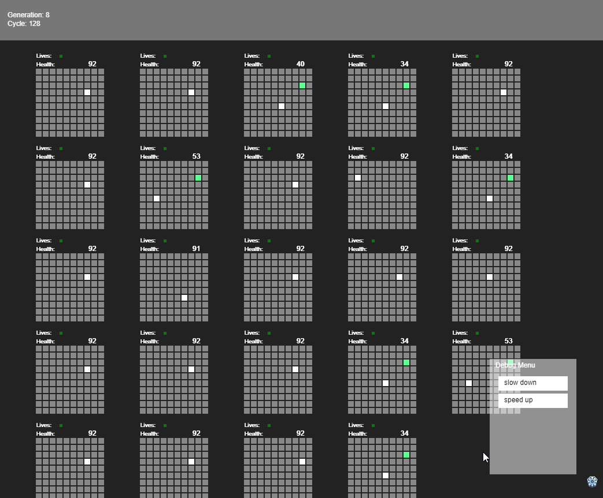

# Playing with Artifical Intelligence - Part I

Just doing a little playing with some Artificial Intelligence. 

I'm using the "neat" javascript library called [Neataptic](https://wagenaartje.github.io/neataptic/). 
It allows you to do a simple evolutionary network with multi-layers. 
(Yeah, go read up on that, I'm not explaining it)

I thought I'd see about training a little bot to eat some food. 

# Understanding the display

Here is a basic map.

The White dot is the bot. The green dot is food. The goal is to get it to find the food as fast as possible. 

All bots start in the middle of the map. (The map is 10 x 10, so they all start at coordinates 5,5).

# The Rules
All maps start with food in the top right corner (8,2). I wanted to make it simple for them to figure out this puzzle.

The bot can take 5 actions
* move north
* move south
* move east
* move west
* eat

It starts with 100 health and every turn it loses 1 health. When it is out of health it dies (stops moving and the score gets locked.)

If it is on top of food and it eats, it gains 10 health.

The score (top right) is the score of the bot. It gets:

* 5 points for eating
* 1 point for moving toward food

That's the rules.

# The Inputs

Each turn the bot can "see" 12 things. it can see all the spots next to it and what it is on top of (that's 9 inputs, think of it as a mini-map.)

It can "see" it's own health.

It can "see" it's own "age" (how many turns it has moved in this cycle)

It can "see" that there is food on the map (not where it is, just if there is food or not, think about it like it can smell the food but not see it)

# Let's play

We set up 25 of these maps (worlds) and let the bots do their thing. 
We let each world go for 200 "steps". 
Meaning if a bot stays alive the whole time, it will be asked 200 times what to do. (most don't live that long)

At end of this cycle, we keep the best 2% of the bots (we keep 5 bots). 
We then create a new population by "breeding" and "mutating" the best 2% to create similar bots to create a new population of 24 bots. 

We take this new population and put them in a world and let them eat.

Side Note: The earth is not flat and neither is this map. So if a bot keeps moving west (left) it will eventually move to the other side as it "crosses" the globe. 
Due to a slight bug (and my laziness) the bot is unable to "see" any food next to it IF it is about to cross over this imaginary line.

How many cycles (or generations) does it take for a bot to go straight for the food?

# First Run

After the first run it took about 20 cycles before the best bot just went stright for the food. 

20 Gens - It would move left and up and then quickly move right directly toward the food. 

30 Gens - They did this for about 10 more generations and then got "dumb" again. 

50 Gens - Going right at the food, this time they went down, crossed over the horizon and went for the food.

70 Gens - Bot is taking the most optimal route to the food, stright up and to the right.

It never really got any better than that. All though every now and then the best bot, the Bot running in the first world, which is allways the best bot of it's generation, would get dumb for a moment. 

Which puzzled me, as I figured once I hit 100 gens, the top bot should always be the best one.

# 2nd Run

20 Gens - It found the food and goes for it. Less then optimal route though

25 Gens - Started taking optimal route, but only the top bot, not the top 2 or 3 (remember it's the best 5 from each gen)

45 Gens - Started to do a little zig-zag pattern across the two corners of the map, getting better

So let's just play with some parameters and see what happens.

These are the current params:

var gameConfig = {
	numWorlds: 24
	,maxLoopsPerGen: 200
	,keepPercent: .2
	,mutationRate: 0.5
	,mutationAmount: 3
	,scoreForEating:5
	,scoreForMovingToFood: 1
	,scoreForMovingAwayFood:0
	,mapSize:10
	,tileSize: 12
	,gameSpeed:10
	,debugMap: false
	};

# Num Worlds(Bots) = 50

Well, it only took it 10 Gens to get to eat the food fast.

The top 5 bots all started to look exactly alike.

Bot 9 and 10 tended to show slight differences, all the rest were random.

(Remember, top 2% are kept alive, so top 10 are the best of the best)

# Mutation Rate = .75 (75%)

How different is a child bot from its parent bot. Previously we had them 50% different, now we will make then 75% different.

10 Gens - Again top 2 bots are going for food, however there is a lot of variation in how they move to the food.

25 Gens - The top 5 have settled on a specific route. Bots 6 - 10 look similar but move slightly different.

# Mutation Rate = .01 (1%)

How different is a child bot from its parent bot. Previously we mad then 50% different, now we will make then 1% different.

Ummm, not enough variance, they all looked alike and they all did the same thing...dumb things.

I suppose if I let them go like 1,000 gens they would eventually get there. I ain't got time for that. (1 Gen takes about 10 seconds...so 1,000 gens would be 10,000 seconds or 3 hours)

# Mutation Rate = .10 (10%)

Hummm, still not enough variation....I think we will stick with 50% mutation rate.

# Mutation Rate = .75 (75%)

Went back to 75% mutation right, took it about 15 Gens to get right.

# Moving Away from Food = -1

So far there is no penalty to moving away from food, but let's add one.

30 Gens - Started to be consistant, but it still "wobbles" on the wrong path sometimes

60 Gens - Something different happened, it stopped moving once it ate the last bit of food. Not all of them, but mayber 3 out of the top 5 would stop moving about three spaces after the food was eaten.

80 Gens - They all stop moving after they ate, and are taking the optimal route.

# Random Food Placement

So let's put the food in a random spot. Now this DRAMATICLLY changes the difficulty. 

90 Gens - Nothing is staying alive for more than 3 gens. I think think the poor things are dying before they can find the food. 

But I'm going to let it run for a few more gens.

170 Gens - They all are doing this wobble dance, one space left, one space right, up ...repeat...I guess that is the most optimal way to find the food

# Let's see what happens if I let them live a little longer....

I think this is what they call an un-solveable problem. Because the food is going to be in a random location, and the bot doesn't know the location, the best it can do is wonder the board as widly as it can. 

Which they are doing...but there is no optimal route to do that so they all do it a little different.

Important Take Away: If the question being asked is not solveable, it will look like the bot is just doing random things.

Side Note: Maybe tee this scenario up and let it run a 1,000 gens and see what happens. I ssuspect nothing...

# Let's drop lots of food

So this go around, we will drop 5 random bits of all over the map.

Still a lot of random non-sense. From what I can tell, they eat too much...it's like 2 moves and then a random eating.

# Penalizing them for eating

They now lose 2 points for attacking (eating) an empty space...

A little better but not a lot...they keep passing eating oppotunities. They will be sitting right beside some food but won't eat it.

# End of ROUND 1

Find an issue with the code. Technical speak follows....

So I spoke about the inputs earlier:

Each turn the bot can "see" 12 things. it can see all the spots next to it and what it is on top of (that's 9 inputs, think of it as a mini-map.)

It can "see" it's own health.

It can "see" it's own "age" (how many turns it has moved in this cycle)

It can "see" that there is food on the map (not where it is, just if there is food or not, think about it like it can smell the food but not see it)

So if X is the bot and F is the food

00F
0X0
000

This is what the array looks like
[0,0,1,0,0,0,0,0,0]

Actually it's this...but white space issues, you know
[0,0,0.2,0,0,0,0,0,0]

The bot takes that in and sends back an array of 5 things. A 1 in a particular spot tells what to do
[0,0,0,0,0] = Do nothing
[1,0,0,0,0] = Move North
[0,0,0,0,1] = Eat

I thought the bot would only give one direction at a time...nope...it gives many

[1,0,0,0,1] = Move North then Eat

So, I was doing all the actions before letting the bot "look" around and see stuff. 

Which meant it would waste a lot of energy before making a new decision.

I did this because the bot never seemed to learn to only give one response.

I'm going to re-code this in version 2.

In version two. I am going to add up all the outputs.

So [1,0,0,0,1] = 2

2 = move east

So [1,1,1,0,1] = 4 = move west

So [1,1,1,1,1] = 5 = eat

Then we will see what happens...and I'll have to run most of these tests again.

Well, it's been fun...till next time.